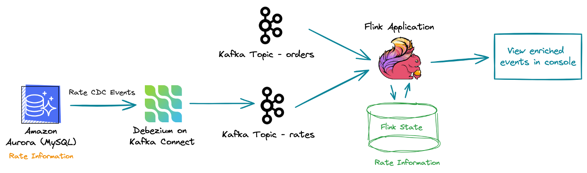

## Architecture

## Setup

Clone the Github repo and execute the docker-compose command. Before that ensure docker host is running in your system.  

    docker-compose up -d

In tab 1 of the terminal, connect to mysql and create the tables.  

    docker exec -it container_mysql mysql -h localhost -u root -p testdb

password: `password`

    CREATE TABLE rates (
        currency VARCHAR(20) NOT NULL, 
        rate FLOAT NOT NULL, 
        last_update_ts TIMESTAMP NOT NULL DEFAULT CURRENT_TIMESTAMP ON UPDATE CURRENT_TIMESTAMP);
    INSERT INTO rates (currency, rate) VALUES ("USD", 1.27), ("EUR", 1.17), ("INR", 106.27), ("GBP", 1);
    GRANT ALL PRIVILEGES ON *.* TO 'debezium'@'%';
    FLUSH PRIVILEGES;

In tab 2 of the terminal, create a Kafka topic `orders`  

    bin/kafka-topics.sh --bootstrap-server localhost:9093 --create --topic orders --replication-factor 1 --partitions 2

    
Also, in the same terminal, run the debezium MySQL connector on Kafka connect  

    curl -i -X POST -H "Accept:application/json" -H "Content-Type:application/json" localhost:8083/connectors --data @debezium-config.json

List the topics  

    bin/kafka-topics.sh --bootstrap-server localhost:9093 --list

    
It should show the following topics -  

    __consumer_offsets  
    kafka_connect_configs  
    kafka_connect_offsets  
    kafka_connect_statuses  
    schema-changes  
    testdb  
    testdb.testdb.rates

    

In tab 3 of the terminal, run the Flink application -  
    
    
    java -cp target/event-enrichment-flink-1.0-SNAPSHOT.jar com.ProcessStreamChangeDataCaptureReferenceData --bootstrap.servers localhost:9093 --raw.event.topic orders --reference.data.topic testdb.testdb.rates --order.consumer.group.id orders-consumer-v1

Once the Flink application runs, it would pick up the `Rate` information from testdb.testdb.rates

In tab 4 of the terminal, run the order generator application -  

    java -cp target/order-Generator-1.0-SNAPSHOT.jar com.amazonaws.kafka.samples.OrderProducer

The order generator application, generate late events periodically. These events are highlighted in yellow.
The Flink application will enrich the events from the `orders` topic with rate information captured from `testdb.testdb.rates` topic.

Now, in tab 1, update the rates - 

    UPDATE rates SET rate=1.31 WHERE currency='USD';
    UPDATE rates SET rate=105.84 WHERE currency='INR';
    UPDATE rates SET rate=1.15 WHERE currency='EUR';

In tab 3, of the Flink application, we would see that the Rate change events are processed by Flink application. All the new order events will use the latest excahnge rates. However any late order events generated will use the exchange rate applicable during the order transaction time.